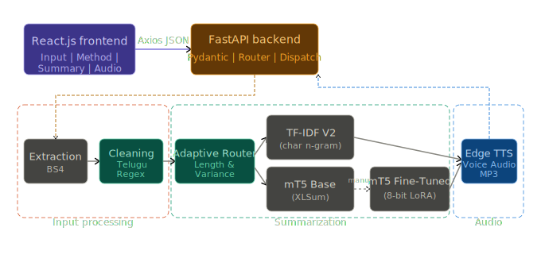
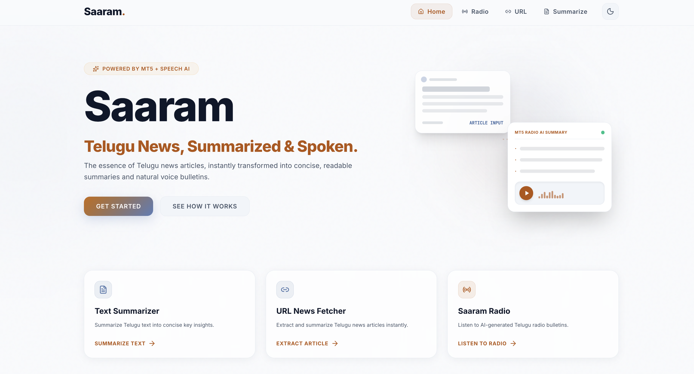
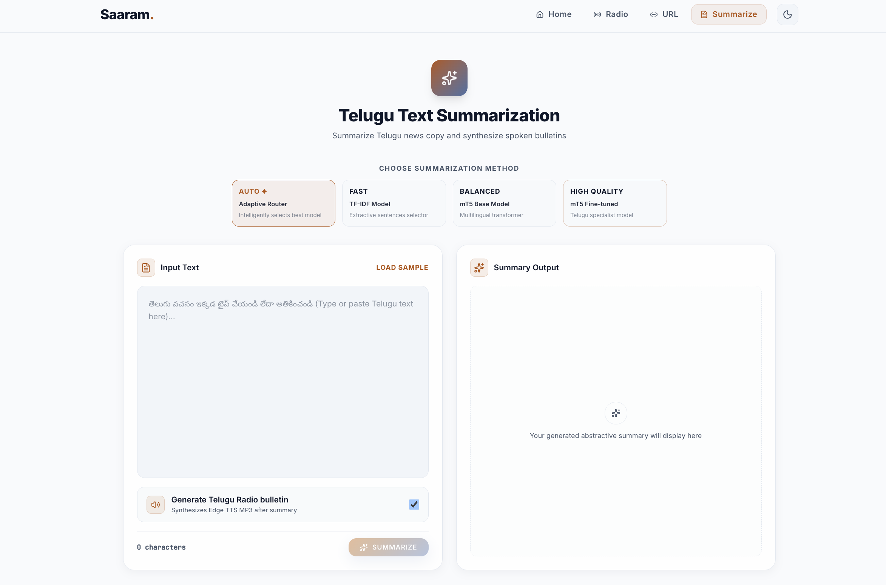
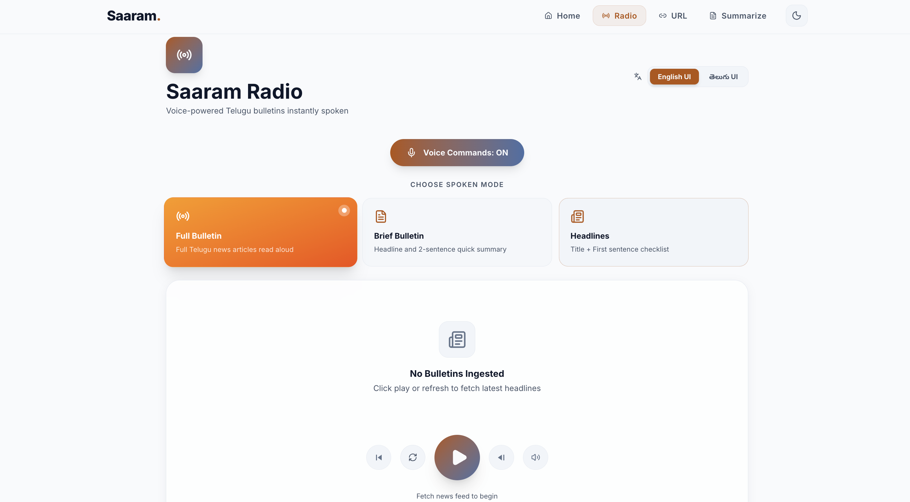

# Saaram (సారం) — Telugu News Summarization & Speech


**Saaram** (సారం, *"essence"*) is a production-deployed Telugu news summarization and speech generation system combining **morphology-aware TF-IDF**, **mT5 transformer summarization**, **adaptive inference routing**, and **Telugu neural text-to-speech**.

Built for **low-resource deployment**: balancing quality, latency, memory efficiency, and reliability under free-tier cloud constraints.

> 📄 Research: Manuscript submitted to **CIS 2026** (NIT Warangal × SCRS, Springer LNNS)
> *Saaram: Resource-Aware Telugu News Summarization with Morphology-Aware TF-IDF and mT5*

---

## 🚀 Live Demo

| | |
|---|---|
| **Frontend** | https://automated-telugu-text-summarization.vercel.app/ |
| **Backend API** | https://harin999-telugu-summarizer-backend.hf.space |
| **API Docs** | https://harin999-telugu-summarizer-backend.hf.space/docs |
| **Health Check** | https://harin999-telugu-summarizer-backend.hf.space/health |

> **Tip:** First request may take 15–30s due to lazy model loading on the free-tier backend. Start with **FAST (TF-IDF)** mode for an instant response, then switch to mT5 once the model is warm.

---

## 🎬 Demo

[Watch Demo](https://drive.google.com/file/d/1rgfnwmlMyelb9kom86JZZnqfqXvFiXeD/view?usp=sharing)

> The demo walks through: homepage → NLP pipeline overview → **text summarization** (AUTO router selecting TF-IDF for a short article, completing in 1.53s with Telugu audio generation) → **URL-based summarization** with a live BBC Telugu article → real-time NLP engine pipeline animation.

---

## ✨ Features

### 📝 Hybrid Summarization Pipeline

Three methods, selectable at runtime:

| Mode | Method | Best for |
|------|--------|----------|
| **FAST** | Morphology-aware TF-IDF | Short articles, instant response |
| **BALANCED** | mT5 Base (pretrained on XLSum) | General Telugu news |
| **HIGH QUALITY** | mT5 Fine-tuned (QLoRA) | When ROUGE precision matters |
| **AUTO** | Adaptive Router | Automatic — picks the best method per request |

### ⚡ Adaptive Router

Routes each request between TF-IDF and mT5 based on:
- **Word count** — short inputs → TF-IDF; long inputs → mT5
- **TF-IDF score variance** — confident extraction → TF-IDF; ambiguous → mT5
- **Available RAM** — low memory → forces TF-IDF fallback

On XL-Sum Telugu (1,302 samples), the router routes 5.38% of requests to TF-IDF and retains near-identical mT5 semantic quality (BERTScore: 0.7241 vs 0.7273).

### 🎙️ Saaram Radio — Telugu Speech Synthesis

Summaries convert to spoken Telugu audio via **Microsoft Edge TTS** (`te-IN-ShrutiNeural`).

Three bulletin modes:
- **Full Bulletin** — complete article read aloud
- **Brief Bulletin** — headline + two-sentence summary
- **Headlines** — title checklist

Supports **voice commands** (Web Speech API) for hands-free navigation. UI available in both English and **తెలుగు** script.

### 🛡️ Fault-Tolerant Inference

Automatic degradation hierarchy:
1. OOM during mT5 → fallback to TF-IDF (API flags degraded mode)
2. Checkpoint load failure → fallback base mT5 → TF-IDF
3. URL extraction failure → structured error with recovery guidance

The system **never returns an unhandled empty response**.

### 🌐 Input Modes

- Direct Telugu text input
- BBC Telugu article URL extraction (BeautifulSoup4)
- Live BBC Telugu RSS feed ingestion

---

## 🏗️ Architecture


Saaram follows a three-tier architecture consisting of:
- React frontend
- FastAPI orchestration layer
- Adaptive NLP inference pipeline with optional speech synthesis

**Deployment:**
- Frontend: Vercel (React + Vite + Tailwind)
- Backend: Hugging Face Spaces (Docker, CPU-only, 16GB RAM)
- Models: lazy-loaded, garbage-collected after idle timeout

---

## 📊 Evaluation Results

Evaluated on the complete **XL-Sum Telugu test split (1,302 samples)**.

| Model | ROUGE-1 | ROUGE-2 | ROUGE-L | BERTScore |
|---|---|---|---|---|
| TF-IDF V1 (word-level) | 0.0709 | 0.0128 | 0.0554 | 0.6626 |
| TF-IDF V2 (char n-gram) | 0.0811 | 0.0162 | 0.0628 | 0.6671 |
| mT5 Base (pretrained) | 0.1610 | 0.0478 | 0.1420 | **0.7273** |
| mT5 Fine-tuned (8-bit LoRA) | **0.1639** | **0.0496** | **0.1452** | 0.7272 |
| Auto Router | 0.1562 | 0.0458 | 0.1372 | 0.7241 |

> BERTScore F1 computed via `bert-base-multilingual-cased` with default rescaling for Telugu. ROUGE uses a custom Unicode-preserving tokenizer — standard ROUGE strips Telugu characters.

**Key findings:**
- Morphology-aware TF-IDF V2 improves **ROUGE-2 by 26.6%** over word-level V1
- 8-bit LoRA fine-tuning improves lexical precision (ROUGE-L +0.0032) but **not semantic quality** (BERTScore unchanged) — a **negative result**: the base checkpoint already saw the XL-Sum Telugu training split during multilingual pretraining
- mT5 substantially outperforms TF-IDF on semantic quality (BERTScore +0.0602)

> 📖 For extended metrics (BLEU, METEOR), statistical significance testing ($p$-values), empirical memory profiling, and $n$-gram sensitivity analysis, see [docs/EVALUATION.md](docs/EVALUATION.md).

---

## ⚙️ Tech Stack

| Layer | Tools |
|---|---|
| Frontend | React, Vite, Tailwind CSS, Framer Motion |
| Backend | FastAPI, Uvicorn, Pydantic |
| NLP | HuggingFace Transformers, PyTorch, scikit-learn |
| Fine-tuning | QLoRA (8-bit quantization, LoRA rank 16, 1.77M params), Kaggle T4 GPU |
| Speech | Microsoft Edge TTS (`te-IN-ShrutiNeural`) |
| Deployment | Hugging Face Spaces (Docker), Vercel |

---

## 📂 Project Structure

```text
.
├── backend/
│   ├── app.py                  # FastAPI API entrypoint
│   ├── pipeline.py             # Core NLP pipeline
│   ├── router.py               # Adaptive inference router
│   ├── summarize_tfidf.py      # TF-IDF summarizer
│   ├── summarize_mt5.py        # mT5 summarizer
│   ├── services/               # RSS / news ingestion
│   ├── extract.py              # URL article extraction
│   ├── clean.py                # Text cleaning & normalization
│   ├── tts.py                  # Telugu speech synthesis
│   └── config.py               # Runtime configuration
│
├── frontend/                   # React + Vite web UI
├── research/                   # Research experiments, notebooks, evaluation
│   ├── paper/                  # Paper figures & screenshots
│   │   └── screenshots/        # UI & demo screenshots
│   ├── notebooks/              # LoRA training notebooks
│   └── evaluation/             # Reproducible evaluation & analysis scripts
│       ├── extended_eval.py          # BLEU & METEOR evaluation
│       ├── significance_analysis.py  # Paired t-tests & Wilcoxon testing
│       ├── memory_profiler.py        # CPU RAM & footprint profiler
│       └── tfidf_ngram_sensitivity.py# Character n-gram range sensitivity
├── assets/                     # Architecture diagrams
├── docs/                       # Technical documentation
├── Dockerfile
├── requirements.txt
└── README.md
```


---

## 🛠️ Local Setup

### Backend

```bash
python -m venv myenv
source myenv/bin/activate
pip install -r requirements.txt
cd backend
uvicorn app:app --reload --host 0.0.0.0 --port 8000
```

### Frontend

```bash
cd frontend
npm install
npm run dev
```

---

## 📸 Screenshots

| Home | Summarize |
|------|-----------|
|  |  |

| URL Mode | Radio Mode |
|----------|------------|
|  |  |

---

## 👥 Team

| Name | Role |
|------|------|
| Hariharan Narlakanti | Backend, NLP, Research |
| Vishnu Vardhan Reddy Padala | Frontend Engineering & UI/UX |
| Vivek Nidumolu | Testing, Debugging |
| Sanjeev Practur | Data Collection & Preprocessing |

---

## 📚 Research Paper

> **Saaram: Resource-Aware Telugu News Summarization with Morphology-Aware TF-IDF and mT5**
>
> Submitted to **CIS 2026 — 7th Congress on Intelligent Systems**, Springer LNNS Proceedings (NIT Warangal × SCRS)

---

## 🔗 Links

- [Live Demo](https://automated-telugu-text-summarization.vercel.app/)
- [Backend API](https://harin999-telugu-summarizer-backend.hf.space)
- [API Docs /docs](https://harin999-telugu-summarizer-backend.hf.space/docs)
- [Technical Docs](docs/)
