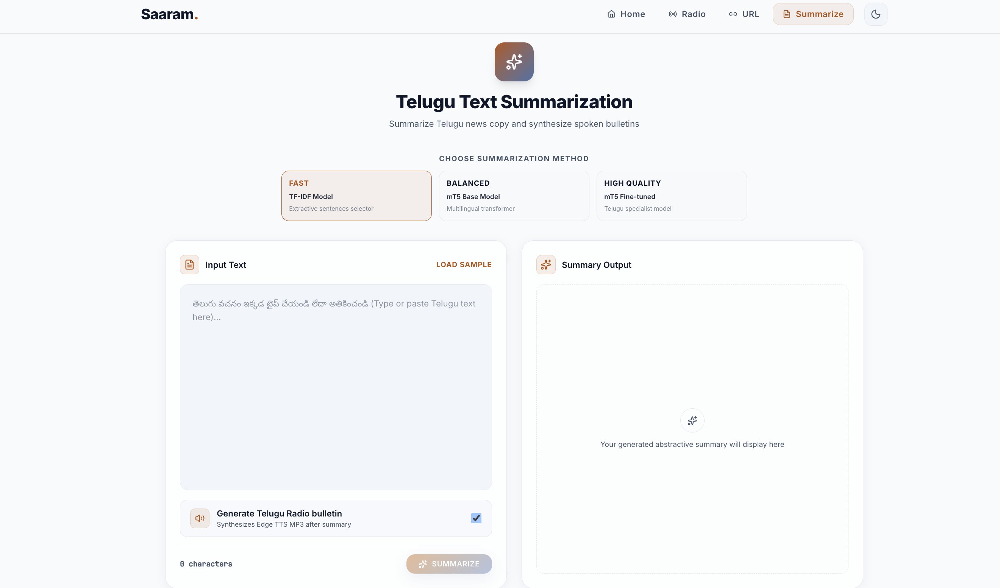
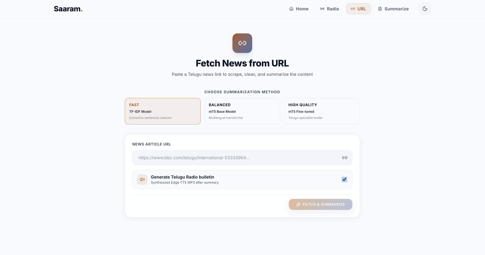
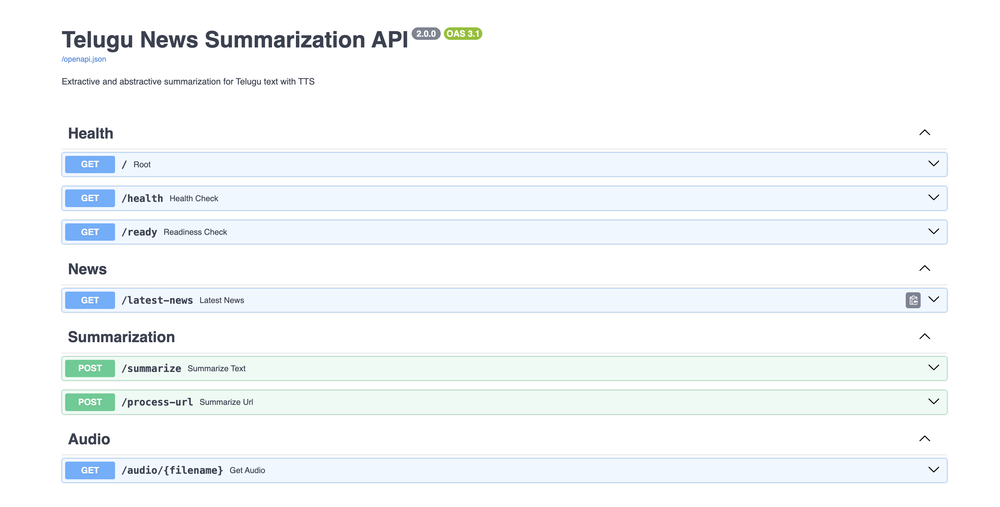

# Automated Telugu Text Summarization & Speech Generation


Practical low-resource Telugu NLP system for news summarization and speech generation, with deployment-focused reliability improvements for constrained hosting.

**Status:** Manuscript prepared for submission to **CIS 2026** (NIT Warangal x SCRS, Springer LNNS series) after withdrawal from ICANITS 2026.

The system supports direct Telugu text input, URL-based article extraction, extractive TF-IDF summarization, transformer-based mT5 summarization, and optional Telugu text-to-speech audio generation with graceful fallback behavior.

## 🚀 Live Demo

- **Frontend:** https://automated-telugu-text-summarization.vercel.app/
- **Backend API:** https://harin999-telugu-summarizer-backend.hf.space
- **API Docs:** https://harin999-telugu-summarizer-backend.hf.space/docs
- **Health Check:** https://harin999-telugu-summarizer-backend.hf.space/health


*For the smoothest demo on free hosting, start with the `TF-IDF` method. Transformer requests may take longer because the model is loaded lazily and Speak mode is intentionally heavier than text-only summarize paths.*

## 🎬 Video Demo

[Watch Demo](https://drive.google.com/file/d/1BcKZtN3p1y47VnsjAZhXa5IvfEEtf2h3/view?usp=sharing)

What the demo shows:
- Telugu text summarization using mT5
- URL-based article summarization
- Runtime model selection with TF-IDF / mT5
- Output generation through FastAPI
- Optional Telugu MP3 audio output
- Graceful fallback behavior for transformer and tokenizer failures

*Note: TTS audio output is supported, but playback may not be audible in the recording depending on screen-recording settings.*

## 🧠 Features & Project Highlights

- **Extractive & Abstractive Summarization:** Support for TF-IDF (extractive) and Hugging Face mT5 (abstractive) summarization in one runtime-selectable pipeline.
- **Robust Model Fallbacks:** Automatically redirects to TF-IDF summarization if mT5/tokenizer fails to load, returning explicit fallback metadata.
- **Audio-First Pipeline (Speak Mode):** Integrates Telugu neural speech generation using Edge TTS with MP3 audio playback.
- **URL & Ingestion Workflows:** URL parsing/article extraction and Telugu RSS ingestion for latest-news workflows.
- **Modern Deployments:** Dockerized FastAPI backend hosted on Hugging Face Spaces (Docker SDK) and a React+Vite frontend on Vercel.

## 🏗️ Architecture


The system operates as a modular NLP pipeline routing inputs (raw text, URL, or RSS feeds) to the FastAPI backend, where texts are normalized, summarized, and optionally converted to speech. 

For full architectural diagrams, pipeline details, and fallback logic documentation, see [docs/MODEL_NOTES.md](docs/MODEL_NOTES.md).

## ⚙️ Tech Stack

| Layer | Tools |
| --- | --- |
| **Frontend** | React, Vite, React Router, Tailwind CSS, Framer Motion |
| **Backend** | FastAPI, Uvicorn, Pydantic |
| **NLP** | Hugging Face Transformers, PyTorch, SentencePiece, scikit-learn |
| **Speech** | Edge TTS (Telugu neural voice) |
| **Deployment** | Hugging Face Spaces (Docker SDK), Vercel |

For reliability and hardening features implemented on this stack, see [docs/RELIABILITY.md](docs/RELIABILITY.md).

## 📂 Project Directory Structure

```text
.
├── backend/          # FastAPI application, pipelines, extractors, fallback logic
├── frontend/         # React, Vite, Framer Motion UI
├── docs/             # Technical specifications and documentation
├── screenshots/      # Application workflow screenshots
├── assets/           # Architecture diagrams and design files
├── Dockerfile        # Backend container packaging
└── requirements.txt  # Backend Python dependencies
```
## 📸 Screenshots

### Home Page


### Text Summarization


### URL Summarization


### Speak News (Radio Mode)


### API Docs


## 📊 Evaluation Snapshot

| Model | ROUGE-1 | ROUGE-2 | ROUGE-L | BERTScore |
| --- | --- | --- | --- | --- |
| TF-IDF | 0.0324 | 0.0034 | 0.0320 | 0.6728 |
| mT5 Base | 0.0436 | 0.0022 | 0.0427 | 0.7239 |
| mT5 Fine-Tuned | 0.0404 | 0.0019 | 0.0400 | 0.7229 |

**Summary:** Baseline mT5 models perform competitively with fine-tuned variants due to limited local dataset size. BERTScore proves to be more informative than token-matching ROUGE scores for morphologically rich languages like Telugu.

For the full evaluation dataset setup, ROUGE/BERTScore analysis, and key research learnings, see [docs/EVALUATION.md](docs/EVALUATION.md).

## 🛠️ Setup & Quickstart

### Backend
```bash
python -m venv myenv
source myenv/bin/activate
pip install -r requirements.txt
cd backend
uvicorn app:app --reload --host 0.0.0.0 --port 8000
```

### Frontend
```bash
cd frontend
npm install
npm run dev
```

For detailed local run instructions, environment variables configuration, and Docker commands, see [docs/DEPLOYMENT.md](docs/DEPLOYMENT.md).

## 👥 Team & Publications

- **Authors / Team:** Hariharan (Backend & NLP), Vishnu (Frontend & UI), Vivek (Testing & Debugging), Sanjeev (Data & Cleaning).
- **Publication Status:** Manuscript prepared for submission to **CIS 2026** (NIT Warangal x SCRS, Springer LNNS series).

---

### 🔗 Quick Links
- [Live Frontend Demo](https://automated-telugu-text-summarization.vercel.app/)
- [Hugging Face Spaces Backend API](https://harin999-telugu-summarizer-backend.hf.space)
- [API Documentation (`/docs`)](https://harin999-telugu-summarizer-backend.hf.space/docs)
- [Technical Documentation Folder](docs/)
