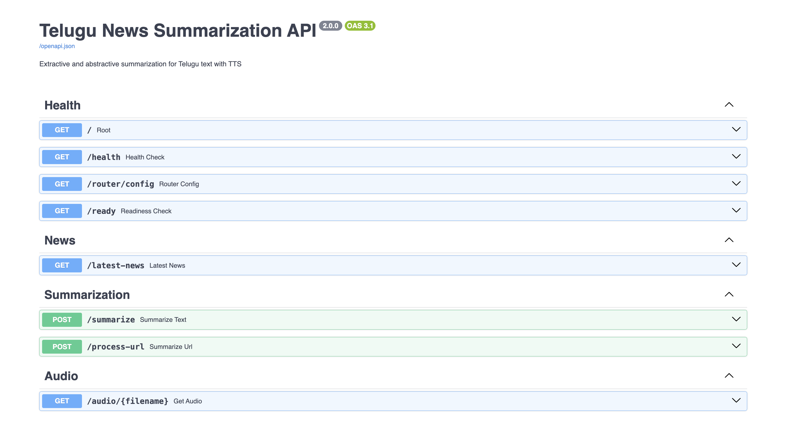

# Saaram (సారం): AI-Powered Telugu News Summarizer


**Saaram** (సారం, *“essence”*) is an end-to-end AI system for **Telugu news summarization and speech generation**, combining **morphology-aware TF-IDF**, **transformer-based mT5 summarization**, **adaptive inference routing**, and **Telugu neural text-to-speech**.

Designed for **low-resource deployment environments**, Saaram focuses on practical NLP engineering: balancing **quality, latency, memory efficiency, and reliability** under constrained cloud infrastructure.

> 📄 **Research Status:** Manuscript submitted to **CIS 2026** (NIT Warangal × SCRS, Springer LNNS series) for peer review.

---

## 🚀 Live Demo

* **Frontend:** https://automated-telugu-text-summarization.vercel.app/
* **Backend API:** https://harin999-telugu-summarizer-backend.hf.space
* **API Docs:** https://harin999-telugu-summarizer-backend.hf.space/docs
* **Health Check:** https://harin999-telugu-summarizer-backend.hf.space/health


> For the smoothest demo on free-tier hosting, start with **TF-IDF mode**. Transformer requests may take longer because models are loaded lazily, and **Radio Mode** is intentionally heavier than text-only summarization.

---

## 🎬 Demo Video

🎥 **Watch Demo**
https://drive.google.com/file/d/1BcKZtN3p1y47VnsjAZhXa5IvfEEtf2h3/view?usp=sharing

The demo showcases:

* Telugu text summarization using mT5
* URL-based article summarization
* Adaptive model selection (TF-IDF / mT5)
* FastAPI inference pipeline
* Telugu MP3 audio generation
* Graceful fallback behavior under failures

*Note: Audio output is supported, but playback may not be audible depending on screen-recording settings.*

---

# ✨ Key Features

## 📝 Dual Summarization Pipeline

Supports both:

* **Extractive summarization** using morphology-aware TF-IDF
* **Abstractive summarization** using multilingual transformer models

This enables quality vs speed trade-offs at runtime.

---

## ⚡ Adaptive Routing

A resource-aware router dynamically chooses the most suitable summarization strategy based on:

* input length
* TF-IDF score variance
* available system memory

This improves reliability under constrained deployments.

---

## 🎙️ Radio Mode (Speech Synthesis)

Generated summaries can be converted into **Telugu audio** using neural speech synthesis via **Edge TTS**.

Supports:

* audio-first consumption
* accessibility
* radio-style news summaries

---

## 🛡️ Fault-Tolerant Inference

If transformer inference fails due to:

* tokenizer errors
* model loading failures
* memory exhaustion

The system automatically falls back to TF-IDF summarization.

---

## 🌐 URL & RSS Ingestion

Supports:

* direct Telugu text input
* article URL extraction
* Telugu RSS news feeds

This enables live news workflows.

---

## 🏗️ Architecture


Saaram operates as a modular NLP pipeline:

```text
Input → Extraction → Cleaning → Adaptive Router → Summarizer → Optional TTS
```

For architecture details, routing logic, and fallback behavior, see:

* `docs/MODEL_NOTES.md`

---

# ⚙️ Tech Stack

| Layer      | Tools                                                           |
| ---------- | --------------------------------------------------------------- |
| Frontend   | React, Vite, Tailwind CSS, React Router, Framer Motion          |
| Backend    | FastAPI, Uvicorn, Pydantic                                      |
| NLP        | Hugging Face Transformers, PyTorch, SentencePiece, scikit-learn |
| Speech     | Edge TTS                                                        |
| Deployment | Hugging Face Spaces (Docker), Vercel                            |

---

# 📂 Project Structure

```text
.
├── backend/
│   ├── app.py
│   ├── pipeline.py
│   ├── router.py
│   └── summarizers
│
├── frontend/
│
├── research/
│   ├── paper/
│   ├── notebooks/
│   ├── evaluation/
│   └── outputs/
│
├── docs/
├── assets/
├── Dockerfile
└── requirements.txt
```

---

# 📸 Screenshots

## Home Page


## Text Summarization


## URL Summarization


## Radio Mode


## API Documentation



---

# 📊 Evaluation Snapshot

| Model                       | ROUGE-1 | ROUGE-2 | ROUGE-L | BERTScore |
| --------------------------- | ------: | ------: | ------: | --------: |
| TF-IDF V1                   |  0.0709 |  0.0128 |  0.0554 |    0.6626 |
| TF-IDF V2                   |  0.0811 |  0.0162 |  0.0628 |    0.6671 |
| mT5 Base                    |  0.1610 |  0.0478 |  0.1420 |    0.7273 |
| mT5 Fine-Tuned (8-bit LoRA) |  0.1639 |  0.0496 |  0.1452 |    0.7272 |

### Key Findings

* Morphology-aware TF-IDF improved **ROUGE-2 by 26.6%**
* Fine-tuning improved lexical overlap but not semantic quality
* Adaptive routing retained **99.56%** of mT5 semantic quality
* BERTScore proved more informative than ROUGE for Telugu

See full analysis in:

* `docs/evaluation.md`

---

# 🛠️ Local Setup

## Backend

```bash
python -m venv myenv
source myenv/bin/activate
pip install -r requirements.txt
cd backend
uvicorn app:app --reload --host 0.0.0.0 --port 8000
```

## Frontend

```bash
cd frontend
npm install
npm run dev
```

More deployment details:

* `docs/DEPLOYMENT.md`

---

# 👥 Team

* **Hariharan Narlakanti** — Backend, NLP, Research
* **Vishnu Vardhan Reddy** — Frontend, UI
* **Vivek Nidumolu** — Testing, Debugging
* **Sanjeev Practur** — Data Collection & Cleaning

---

# 📚 Publication

**Paper Title:**
**Saaram: Resource-Aware Telugu News Summarization with Morphology-Aware TF-IDF and mT5**

Submitted to:

**CIS 2026 — 7th Congress on Intelligent Systems**
Springer LNNS Proceedings

---

# 🔗 Quick Links

* [Live Frontend Demo](https://automated-telugu-text-summarization.vercel.app/)
* [Hugging Face Spaces Backend API](https://harin999-telugu-summarizer-backend.hf.space)
* [API Documentation (`/docs`)](https://harin999-telugu-summarizer-backend.hf.space/docs)
* [Technical Documentation Folder](docs/)
